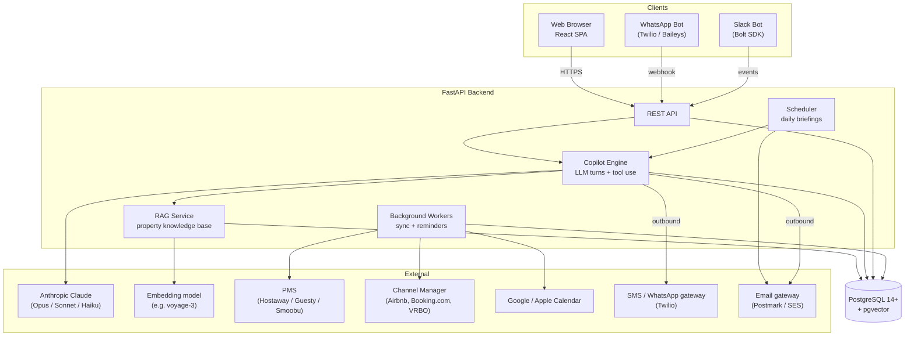
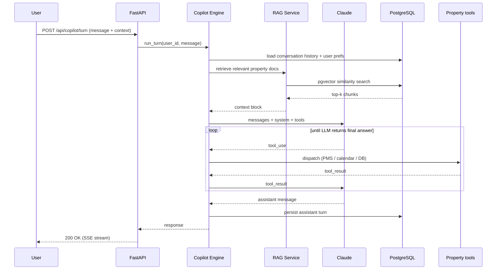
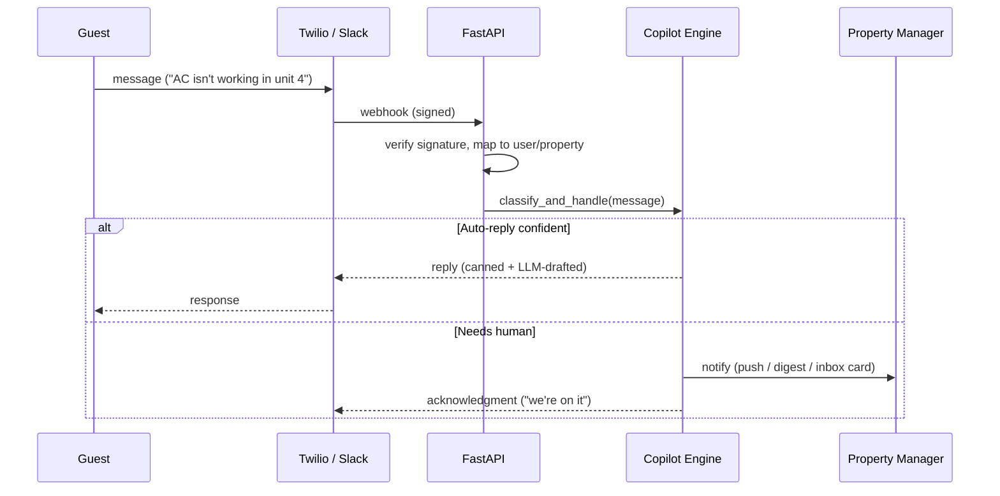
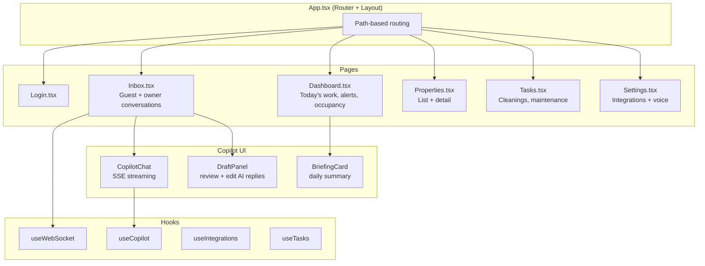
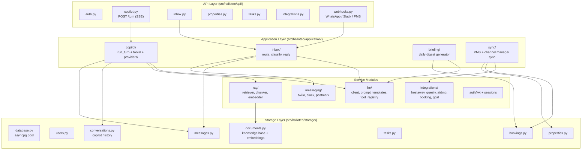
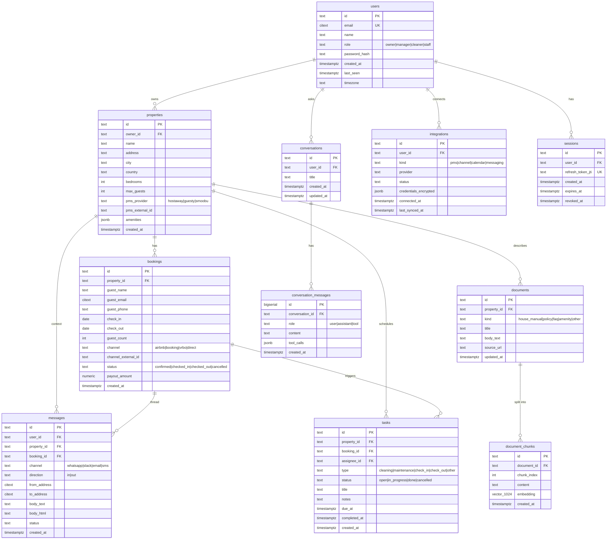
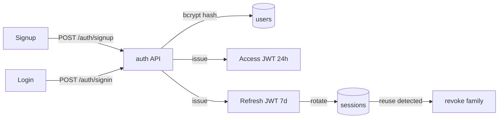

# Hallo Theo — Architecture

Hallo Theo is an AI copilot for property management. It helps property managers and short-term-rental hosts handle the operational work that lives in their inbox and chat — guest questions, vendor coordination, owner reporting, booking issues — by reading from their property management system (PMS), channel managers, calendars, and messages, then drafting responses, scheduling tasks, and surfacing what needs attention.

_Last refreshed: 2026-05-23._

## System Overview

## Copilot Turn (LLM + Tools)

## Inbound Message Flow (WhatsApp / Slack)

## Frontend Architecture

## Backend Module Structure

## Data Model (PostgreSQL)

> **Schema baseline** lives in `src/halloteo/storage/schema.sql`; production state is the baseline plus all migrations under `src/halloteo/storage/migrations/`.

## Authentication

## Key Design Decisions

| Decision | Rationale |
|----------|-----------|
| **FastAPI + asyncpg + Pydantic v2** | Single async stack; Pydantic v2 for fast validation; minimal magic. |
| **PostgreSQL 14+ with pgvector** | One database for relational data and embeddings — no separate vector DB during the hackathon. `citext` for case-insensitive emails. |
| **Anthropic Claude as primary LLM** | Tool use is first-class; routing by tier (Haiku for classify/route, Sonnet for reasoning, Opus only when escalated). |
| **Tool-use copilot, not free-form generation** | The copilot must take real actions (read PMS, draft replies, create tasks). Tools enforce structure and auditability. |
| **WebSocket only for live UI events** | Browser↔backend pushes (new message, sync progress). Bots use webhooks. |
| **No external task queue (v0)** | All background work via `asyncio.create_task()` orchestrated in `initialization/background_tasks.py`. Add Celery/RQ only if we hit scale issues. |
| **Encrypted integration credentials** | OAuth refresh tokens, PMS API keys, Twilio tokens encrypted at rest with a server-side key. |
| **Property-scoped multi-tenancy** | Every query filters by `user_id` or `property_id`. No global queries from the API surface. |
| **Prompts versioned in code** | `src/halloteo/llm/prompts/` — every prompt change is a commit, never a config flip. |
| **Hackathon: single deploy target** | One process, one Postgres, one domain. Defer blue/green and worker fleet until post-hackathon. |

## Open Questions

> Update this list as decisions land — leaving a question open here is fine; ignoring it is not.

- Which PMS do we integrate first? (Hostaway likely — best API.)
- WhatsApp via Twilio (regulated, easy onboarding) or Baileys (unrestricted, fragile)?
- How aggressive should auto-reply be? Pure suggestion vs. send-on-confidence?
- Do we need a notion of "team" (multiple managers per property) before Day 2?
- Embedding model: voyage-3 (best retrieval) vs. OpenAI text-embedding-3-small (cheaper)?
